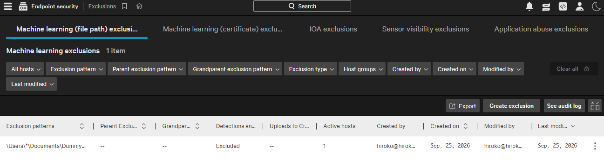

# Examice 1-10

✅❌

### Question 1 of 248

What is the function of a single asterisk (\*) in an ML exclusion pattern?

1. The single asterisk will match any number of characters, including none. It does include separator characters, such as \ or /, which separate portions of a file path

2. The single asterisk will match any number of characters, including none. It does not include separator characters, such as \ or /, which separate portions of a file path✅

3. The single asterisk is the insertion point for the variable list that follows the path

4. The single asterisk is only used to start an expression, and it represents the drive letter

#### Answer

- ML exclusion pattern
- Endpoint security → Configure → Exclusions
- Host groups
- Exclusion pattern `\Users\*\Documents\DummyApp\*.exe`
- ☑ Detections and preventions, ☐ Uploads to CrowdStrike
- administrators may need to exclude certain files, folders, or processes from CrowdStrike Falcon scanning. This is useful for preventing interference with critical applications, reducing false positives, and optimizing system performance.



- https://inventivehq.com/knowledge-base/crowdstrike/how-to-configure-exclusions-in-crowdstrike-falcon

---

### Question 2 of 248

You have determined that you have numerous Machine Learning detections in your environment that are false positives. They are caused by a single binary that was custom written by a vendor for you and that binary is running on many endpoints. What is the BEST way to prevent these in the future?

1. Contact support and request that they modify the Machine Learning settings to no longer include this detection
2. Using IOC Management, add the hash of the binary in question and set the action to "Allow"✅
3. Using IOC Management, add the hash of the binary in question and set the action to "Block, hide detection"
4. Using IOC Management, add the hash of the binary in question and set the action to "No Action"

#### Answer

- Endpoint security -> IOC management -> three dots -> Add Hashes
- Hash vs path: An ML exclusion by file path

```
PS C:\Windows\System32> Get-FileHash "C:\Program Files\Google\Chrome\Application\chrome.exe"
SHA256          73AAAC25447E2A4626D87B279DC900B5333CB78A84CA3D6BBFC766D9B0C60560
```

```
IOC management -> Add Hashes
Get-FileHash command
only this Chrome vesrion,
Allow=Falcon won't detect or block this file
Hash vs path = IOC management vs ML exclusion
```

---

### Question 3 of 248

What is the purpose of a containment policy?

- To define allowed IP addresses over which your hosts will communicate when contained✅

#### Answer

- A containment policy is where you list the IP addresses a host can still talk to while it's network-contained

```
Why the allowed IP list matters: While a computer is in quarantine, you may still need a few "doctors" to reach it, like your DNS server or IT tools. The containment policy is where you list those trusted IPs.
```

---

### Question 4 of 248

An administrator creating an exclusion is limited to applying a rule to how many groups of hosts?

- There is no limit and exclusions can be applied to any or all groups✅

#### Answer

- That's correct. There's no limit: an exclusion can apply to **one**, **several**, or **all host** groups.

---

### Question 5 of 248

Even though you are a Falcon Administrator, you discover you are unable to use the "Connect to Host" feature to gather additional information which is only available on the host. Which role do you need added to your user account to have this capability?

- Real Time Responder✅
