# Examice 1-10

✅❌

### Question 1 of 248

What is the function of a single asterisk (\*) in an ML exclusion pattern?

1. The single asterisk will match any number of characters, including none. It does include separator characters, such as \ or /, which separate portions of a file path

2. The single asterisk will match any number of characters, including none. It does not include separator characters, such as \ or /, which separate portions of a file path✅

3. The single asterisk is the insertion point for the variable list that follows the path

4. The single asterisk is only used to start an expression, and it represents the drive letter

#### Answer

- ML exclusion pattern
- Endpoint security → Configure → Exclusions
- Host groups
- Exclusion pattern `\Users\*\Documents\DummyApp\*.exe`
- ☑ Detections and preventions, ☐ Uploads to CrowdStrike
- administrators may need to exclude certain files, folders, or processes from CrowdStrike Falcon scanning. This is useful for preventing interference with critical applications, reducing false positives, and optimizing system performance.

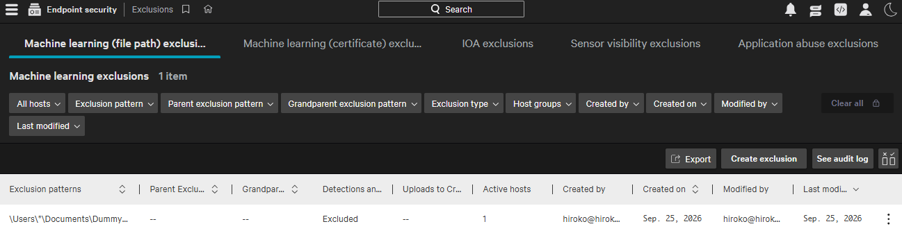

- https://inventivehq.com/knowledge-base/crowdstrike/how-to-configure-exclusions-in-crowdstrike-falcon

---

### Question 2 of 248

You have determined that you have numerous Machine Learning detections in your environment that are false positives. They are caused by a single binary that was custom written by a vendor for you and that binary is running on many endpoints. What is the BEST way to prevent these in the future?

1. Contact support and request that they modify the Machine Learning settings to no longer include this detection
2. Using IOC Management, add the hash of the binary in question and set the action to "Allow"✅
3. Using IOC Management, add the hash of the binary in question and set the action to "Block, hide detection"
4. Using IOC Management, add the hash of the binary in question and set the action to "No Action"

#### Answer

- Endpoint security -> IOC management -> three dots -> Add Hashes
- Hash vs path: An ML exclusion by file path

```
PS C:\Windows\System32> Get-FileHash "C:\Program Files\Google\Chrome\Application\chrome.exe"
SHA256          73AAAC25447E2A4626D87B279DC900B5333CB78A84CA3D6BBFC766D9B0C60560
```

```
IOC management -> Add Hashes
Get-FileHash command
only this Chrome vesrion,
Allow=Falcon won't detect or block this file
Hash vs path = IOC management vs ML exclusion
```

---

### Question 3 of 248

What is the purpose of a containment policy?

- To define allowed IP addresses over which your hosts will communicate when contained✅

#### Answer

- A containment policy is where you list the IP addresses a host can still talk to while it's network-contained

```
Why the allowed IP list matters: While a computer is in quarantine, you may still need a few "doctors" to reach it, like your DNS server or IT tools. The containment policy is where you list those trusted IPs.
```

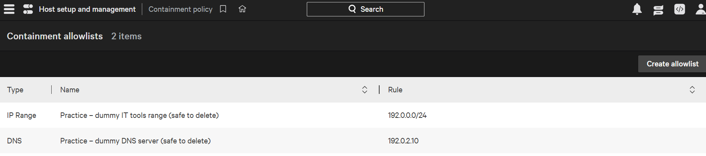

---

### Question 4 of 248

An administrator creating an exclusion is limited to applying a rule to how many groups of hosts?

- There is no limit and exclusions can be applied to any or all groups✅

#### Answer

- That's correct. There's no limit: an exclusion can apply to **one**, **several**, or **all host** groups.

---

### Question 5 of 248

Even though you are a Falcon Administrator, you discover you are unable to use the "Connect to Host" feature to gather additional information which is only available on the host. Which role do you need added to your user account to have this capability?

- Real Time Responder✅

---

### Question 6 of 248

What must an admin do to reset a user's password?

- From User Management, open the account details for the affected user and select "Generate New Password"❌
- From User Management, select "Reset Password" from the three dot menu for the affected user account✅

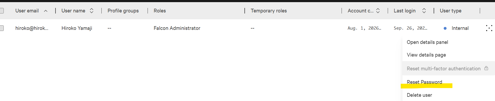

---

### Question 7 of 248

Your organization has a set of servers that are not allowed to be accessed remotely, including via Real Time Response (RTR). You already have these servers in their own Falcon host group. What is the next step to disable RTR only on these hosts?

- Create a new Response Policy, toggle the "Real Time Response" switch off and assign the policy to the host group✅

---

### Question 8 of 248

When creating new IOCs in IOC management, which of the following fields must be configured?

- Hash, Platform and Action✅

---

### Question 9 of 248

Your CISO has decided all Falcon Analysts should also have the ability to view files and file contents locally on compromised hosts, but without the ability to take them off the host. What is the MOST appropriate role that can be added to fullfil this requirement?

- Real Time Responder – Read Only Analyst✅
- Falcon Analyst – Read Only

---

### Question 10 of 248

One of your development teams is working on code for a new enterprise application but Falcon continually flags the execution as a detection during testing. All development work is required to be stored on a file share in a folder called "devcode." What setting can you use to reduce false positives on this file path?

- Machine Learning Exclusions

> To reduce false positives on a specific file path for development work, such as the 'devcode' folder mentioned, adjusting the Machine Learning Exclusions is the appropriate setting. This allows you to exclude specific files or directories from being flagged by machine learning algorithms, thus minimizing false positives during development testing.

---

### Question 11 of 248

How do you disable all detections for a host?

- In Host Management, select the host and then choose the option to Disable Detections✅

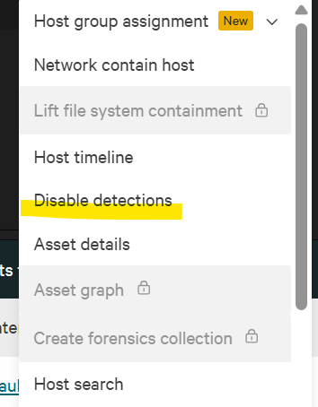

---

### Question 12 of 248

To enhance your security, you want to detect and block based on a list of domains and IP addresses. How can you use IOC management to help this objective?

- Blocking of Domains and IP addresses is not a function of IOC management. A Custom IOA Rule should be used instead✅

---

### Question 13 of 248

Which role is required to manage groups and policies in Falcon?

- Falcon Host Administrator✅

| Old name (exam)                 | Current name (console)     |
| ------------------------------- | -------------------------- |
| Falcon Host Administrator       | **Falcon Administrator**   |
| Falcon Host Analyst             | Falcon Analyst             |
| Falcon Host Analyst – Read Only | Falcon Analyst – Read Only |
| Falcon Host Security Lead       | Falcon Security Lead       |

---

### Question 14 of 248

Which of the following can a Falcon Administrator edit in an existing user's profile?

- First or Last name ✅
- Phone number
- Email address
- Working groups

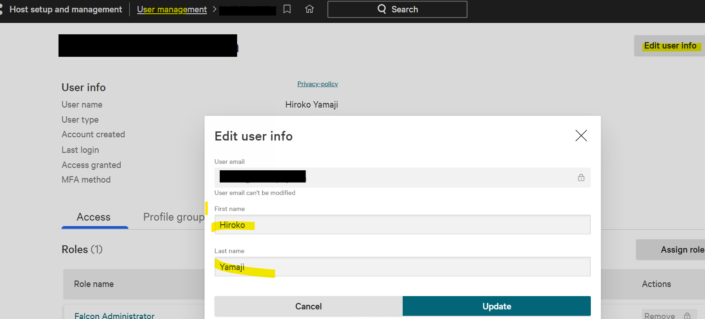

---

### Question 15 of 248

You want the Falcon Cloud to push out sensor version changes but you also want to manually control when the sensor version is upgraded or downgraded. In the Sensor Update policy, which is the best Sensor version option to achieve these requirements?

- Specific sensor version number✅
- Auto - TEST-QA❌

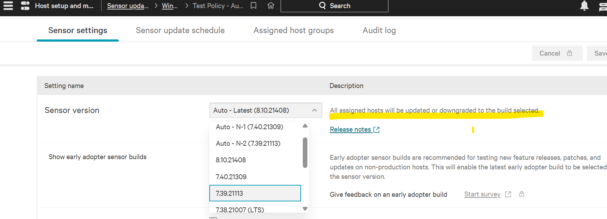

---

### Question 16 of 248

What is the goal of a Network Containment Policy?

- Limit the impact of a compromised host on the network✅

```
The goal of a Network Containment Policy is to limit the impact of a compromised host on the network. This policy is designed to isolate or contain any threats or compromised devices to prevent them from spreading and affecting other parts of the network. It helps in mitigating the damage and maintaining network integrity.
- Host Setup and Management > Containment Policy > Add allowlist entry.
```

---

### Question 17 of 248

Which of the following applies to Custom Blocking Prevention Policy settings?

- A. Hashes must be entered on the Prevention Hashes page before they can be blocked via this policy✅
- B. Blocklisting applies to hashes, IP addresses, and domains❌

```
Hashes must be entered on the Prevention Hashes page before they can be blocked via this policy. Custom blocking in prevention policies refers to blocklisting hashes through the IOC Management, and hashes need to be added here first. There is no mention of blocklisting IP addresses and domains under custom blocking settings, nor the necessity for remediation after partial executions.
```

---

### Question 18 of 248

How many "Auto" sensor version update options are available for Windows Sensor Update Policies?

- 3✅

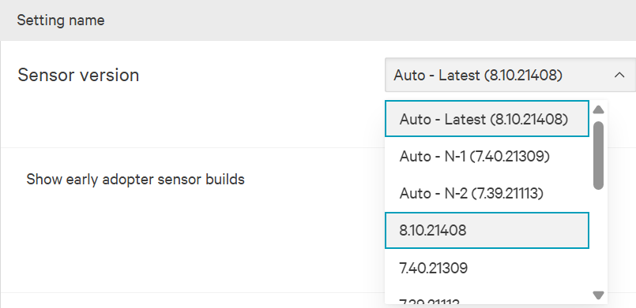

---

### Question 19 of 248

The alignment of a particular prevention policy to one or more host groups can be completed in which of the following locations within Falcon?

- Policy alignment is configured in the "Host Management" section in the Hosts application
- Policy alignment is configured in each policy in the "Assigned Host Groups" tab✅

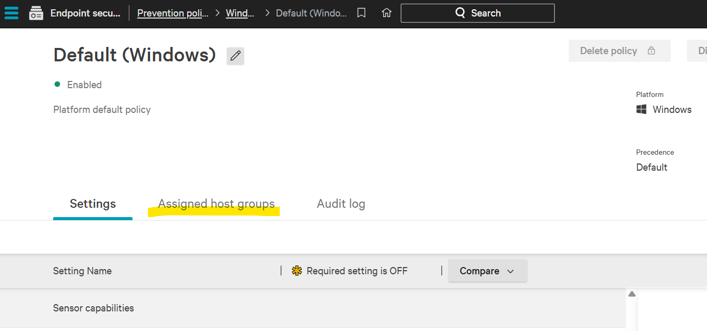

---

### Question 20 of 248

How long are detection events kept in Falcon?

- Detection events are kept for 90 days✅
- Detections events are kept for your subscribed data retention period❌

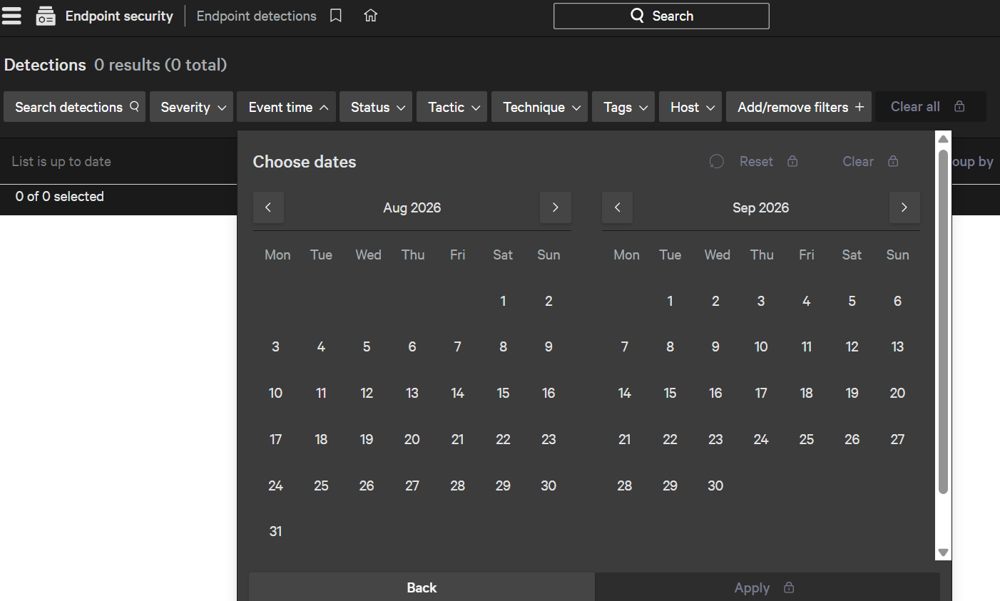

---

### Question 21 of 248

What information is provided in Logon Activities under Visibility Reports?

- A list of last endpoints that a user logged in to

> In Logan Activities under Visibility Reports, the information provided includes a list of the last endpoints that a user logged in to.

---

### Question 22 of 248

What can the Quarantine Manager role do?

- Manage quarantined files to release and download✅

> The Quarantine Manager role is responsible for handling quarantined files, including managing, releasing, and downloading them

---

### Question 23 of 248

What command should be run to verify if a Windows sensor is running?

- sc query csagent✅

```
C:\Windows\System32>sc query csagent

SERVICE_NAME: csagent
        TYPE               : 2  FILE_SYSTEM_DRIVER
        STATE              : 4  RUNNING
                                (STOPPABLE, NOT_PAUSABLE, IGNORES_SHUTDOWN)
        WIN32_EXIT_CODE    : 0  (0x0)
        SERVICE_EXIT_CODE  : 0  (0x0)
        CHECKPOINT         : 0x0
        WAIT_HINT          : 0x0

C:\Windows\System32>
```

---

### Question 24 of 248❌

When configuring a specific prevention policy, the admin can align the policy to two different types of groups, Host Groups and which other?

- Custom IOA Rule Groups✅

> When configuring a specific prevention policy, the admin can align the policy to two different types of groups, Host Groups, and Custom IOA Rule Groups.

> Indicators of Attack (IOA)

---

## Question 25 of 248

Which role allows a user to connect to hosts using Real-Time Response?

- Real Time Responder – Active Responder✅

> is role specifically grants the permissions needed for real-time interaction with endpoints, which includes executing commands and performing investigative tasks

---

### Question 26 of 248

You are attempting to install the Falcon sensor on a host with a slow Internet connection and the installation fails after 20 minutes. Which of the following parameters can be used to override the 20 minute default provisioning window?

- ProvNoWait=1✅

### Answer

- **ProvNoWait=1** skips the wait entirely. The install completes even if the sensor can't reach the cloud yet, and it finishes provisioning later when it connects. This is common for golden images or hosts that are temporarily offline.
- **ProvWaitTime**=<milliseconds> extends the provisioning window. The default is 1200000 (20 minutes); for example, ProvWaitTime=3600000 gives it an hour to reach the cloud.

```
WindowsSensor.exe /install /quiet /norestart CID=<CID> ProvNoWait=1
WindowsSensor.exe /install /quiet /norestart CID=<CID> ProvWaitTime=3600000
```

---

### Question 27 of 248

How can you find a list of hosts that have not communicated with the CrowdStrike Cloud in the last 30 days?

- A. Under Dashboards and reports, choose the Sensor Report. Set the "**Last Seen**" dropdown to 30 days and reference the Inactive Sensors widget✅

---

### Question 28 of 248

In order to quarantine files on the host, what prevention policy settings must be enabled?

- Next-Gen Antivirus Prevention sliders and "Quarantine & Security Center Registration" must be enabled✅

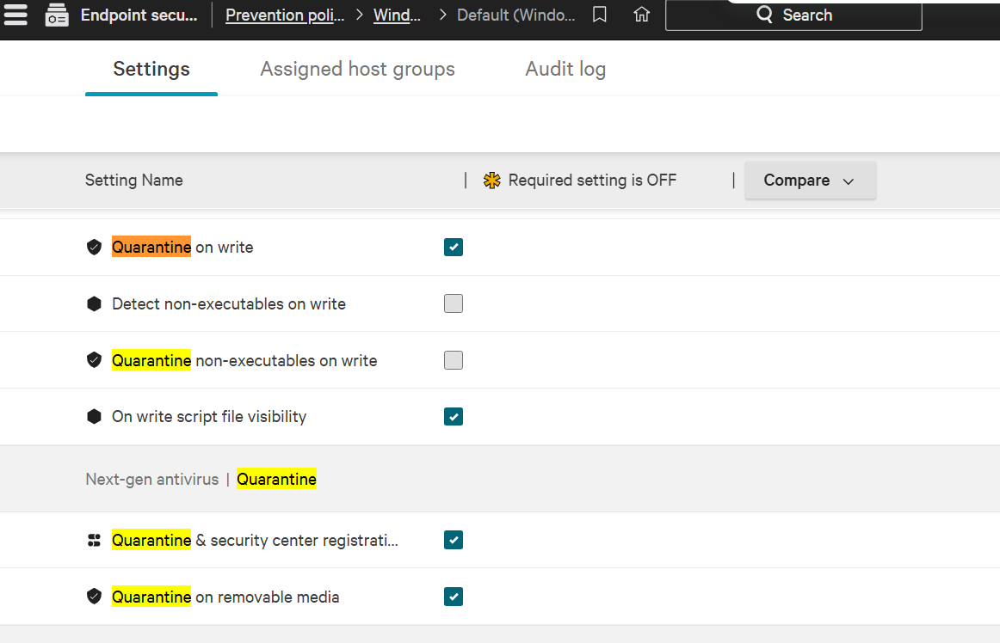
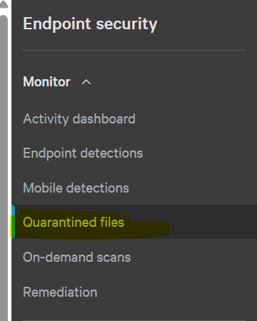

---

### Question 29 of 248

Why is it critical to have separate sensor update policies for Windows/Mac/\*nix?

- There may be special considerations for each OS✅

> Correct. Each operating system has its own sensor build and release schedule, so updates are managed per platform:

> Different sensor versions: Windows, Mac, and Linux sensors are released and numbered separately, so a version that's right for Windows doesn't apply to Mac.

---

## Question 30 of 248

How do you assign a policy to a specific group of hosts?

- Create a group containing the desired hosts using "Static Assignment." Go to the Assigned Host Groups tab of the desired policy and dick "Add groups to policy." Select the desired Group(s).✅

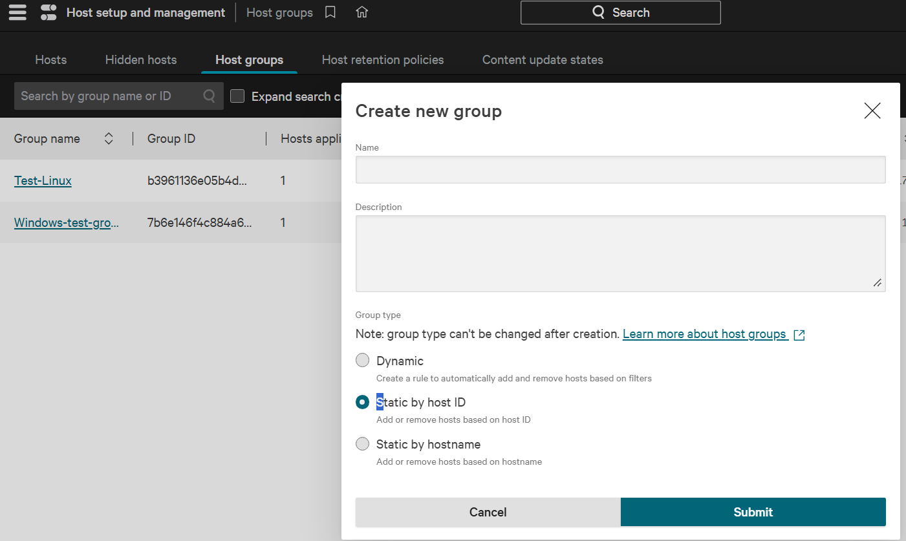

---

### Question 31 of 248

You want to create a detection-only policy. How do you set this up in your policy's settings?

- Set the Next-Gen Antivirus detection settings to the desired detection level and all the prevention sliders to disabled. Do not activate any of the other blocking or malware prevention options.

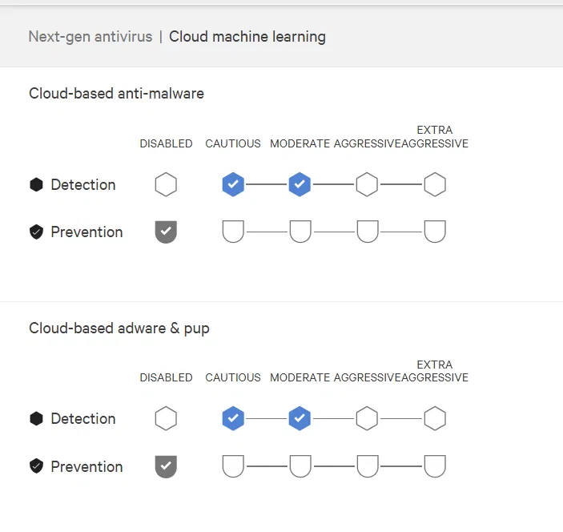

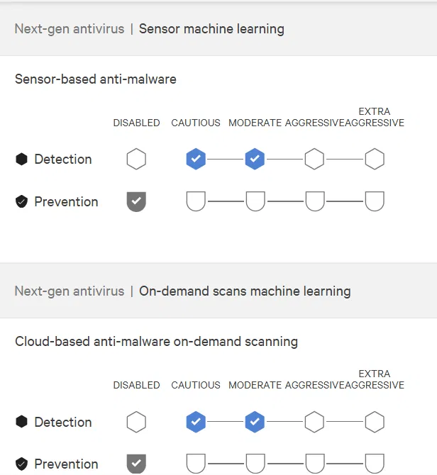

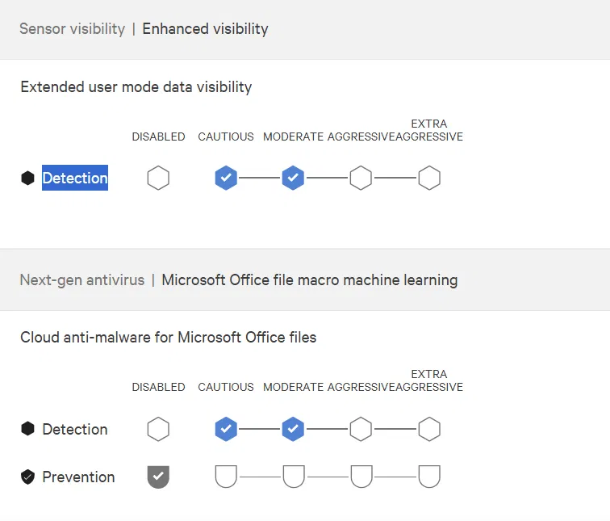

---

### Question 32 of 248

Which of the following is an effective Custom IOA rule pattern to kill any process attempting to access www.badguydomain.com?

- `.*badguydomain\.com.*`✅

#### Answer

`.*badguydomain\.com.*` just means "match anything that has badguydomain.com anywhere in it."

- `.*` = any characters, any amount, before
- `badguydomain\.com` = the actual domain (the `\.` just means a literal dot, not "any character")
- `.*` = any characters, any amount, after

So it catches `www.badguydomain.com`, `sub.badguydomain.com/page`, `http://badguydomain.com`, or anything else with that domain buried inside it, and CrowdStrike kills whatever process is trying to reach it.

### Question 33 of 248

Where can you modify settings to permit certain traffic during a containment period?

- Containment Policy✅

> To modify settings to permit certain traffic during a containment period, you would use the Containment Policy. This policy is specifically designed for managing network traffic and implementing controls during containment scenarios, allowing selective permissions and adjustments to traffic flow in response to incidents.

### Question 34 of 248

Which option allows you to exclude behavioral detections from the detections page?

- IOA Exclusion✅

IOA Exclusion tells Falcon "don't show me detections that match this specific behavior pattern anymore." It's for behavioral/IOA-based detections specifically, as opposed to file-based ones (which use ML/IOC exclusions instead).

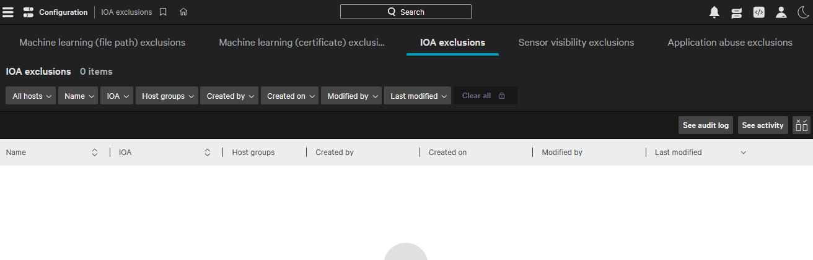

---

### Question 35 of 248

What are custom alerts based on?

- Predefined alert templates✅

Custom alerts are based on predefined alert templates. This is because custom alerts often utilize pre-existing templates that can be configured to meet specific needs, rather than creating entirely new event triggers from scratch.

---

### Question 36 of 248

When creating an API client, which of the following must be saved immediately since it cannot be viewed again after the client is created?

- Secret✅

> When creating an API client, the 'Secret' must be saved immediately since it cannot be viewed again

### Question 37 of 248

You notice there are multiple Windows hosts in Reduced functionality mode (RFM). What is the most likely culprit causing these hosts to be in RFM?

- A host was placed in network containment from a detection✅

> Reduced Functionality Mode (RFM) typically occurs when a host cannot verify its license or activation status with a Key Management Service (KMS) server. This situation often arises when a host is placed in network containment, preventing it from communicating with the KMS server. Therefore, the most likely culprit causing these hosts to be in RFM is that the host was placed in network containment from a detection.

---

## Question 38 of 248

Which of the following is TRUE of the Logon Activities Report?

A. Shows a graphical view of user logon activity and the hosts the user connected to✅

B. The report can be filtered by computer name

C. It gives a detailed list of all logon activity for users

D. It only gives a summary of the last logon activity for users

> It's built as a visual (graph/node-style) report mapping users to the hosts they logged into over a time period, which makes it useful for spotting patterns like lateral movement. It's not a flat, detailed list (that rules out C), it's not limited to just the last logon (rules out D), and filtering by computer name isn't its defining feature (rules out B) — the graphical mapping is the core characteristic being tested here.

### Question 39 of 248

Which of the following roles allows a Falcon user to create Real Time Response Custom Scripts?

- Real Time Responder – Administrator

---

### Question 40 of 248

What model is used to create workflows that would allow you to create custom notifications based on particular events which occur in the Falcon platform?

Trigger, condition(s) and action(s)

> The model that is used to create workflows in the Falcon platform, which allows for custom notifications based on particular events, is comprised of triggers, conditions, and actions. This structure enables the system to respond to specific events by checking certain conditions and then performing designated actions.

---

### Question 41 of 248

An analyst is asked to retrieve an API client secret from a previously generated key. How can they achieve this?

- The API client secret cannot be retrieved after it has been created

> The API client secret cannot be retrieved after it has been created. This is a common security practice to ensure that sensitive credentials are not exposed or reused improperly.

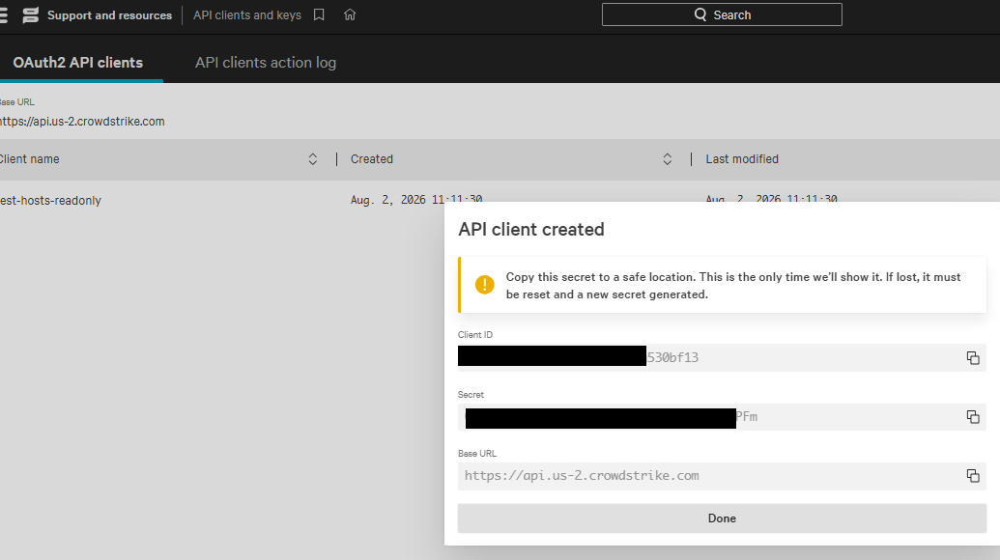
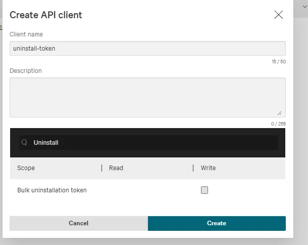

---

## Question 42 of 248

Which port and protocol does the sensor use to communicate with the CrowdStrike Cloud?

- TCP port 443 (HTTPS)✅

> The sensor communicates with the CrowdStrike Cloud using TCP port 443 (HTTPS).

---

### Question 43 of 248

Where do you obtain the Windows sensor installer for CrowdStrike Falcon?

- Sensors are downloaded from the Hosts > Sensor Downloads✅

---

### Question 44 of 248

What is the most common cause of a Windows Sensor entering Reduced Functionality Mode (RFM)?

- Microsoft updates✅

> The most common cause of a Windows Sensor entering Reduced Functionality Mode (RFM) is due to Microsoft updates. When Microsoft releases updates, the kernel needs to be verified and certified for the new sensor version. If this verification process fails or is pending, the sensor runs in RFM.

---

### Question 45 of 248

On which page of the Falcon console would you create sensor groups?

- Sensor update policies❌
- Host groups✅

---

### Question 46 of 248

While a host is Network contained, you need to allow the host to access internal network resources on specific IP addresses to perform patching and remediation. Which configuration would you choose?

- A. Configure a Real Time Response policy allowlist with the specific IP addresses
- B. Configure a Containment Policy with the specific IP addresses✅
- C. Configure a Containment Policy with the entire internal IP CIDR block
- D. Configure the Host firewall to allowlist the specific IP addresses

> When a host is network contained and needs to access specific internal IP addresses for patching and remediation, the correct approach is to configure a Containment Policy with the specific IP addresses. This policy manages the rules and exceptions that apply specifically to contained hosts, ensuring they can communicate with necessary IPs while remaining contained from other network traffic.

---

### Question 47 of 248

Which of the following is TRUE regarding Falcon Next-Gen AntiVirus (NGAV)?

- A. Falcon NGAV relies on signature-based detections
- B. Activating Falcon NGAV will also enable all detection and prevention settings in the entire policy
- C. The Detection sliders cannot be set to a value less aggressive than the Prevention sliders✅
- D. Falcon NGAV is not a replacement for Windows Defender or other antivirus programs

> The Detection sliders in Falcon Next-Gen AntiVirus (NGAV) cannot be set to a value less aggressive than the Prevention sliders, ensuring that the detection of threats is prioritized equally or more stringently than their prevention.
