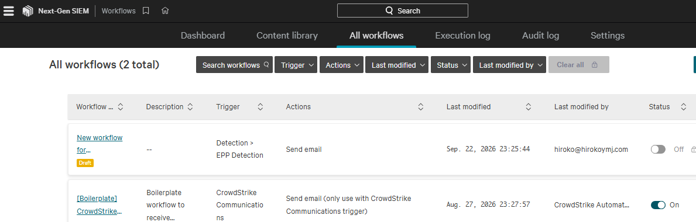
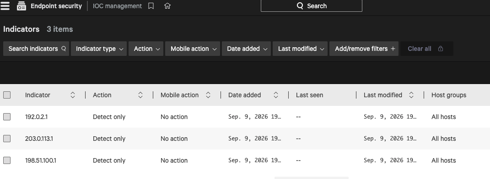
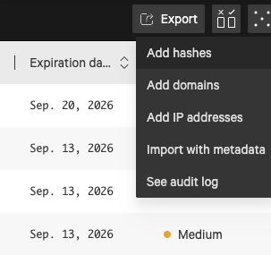
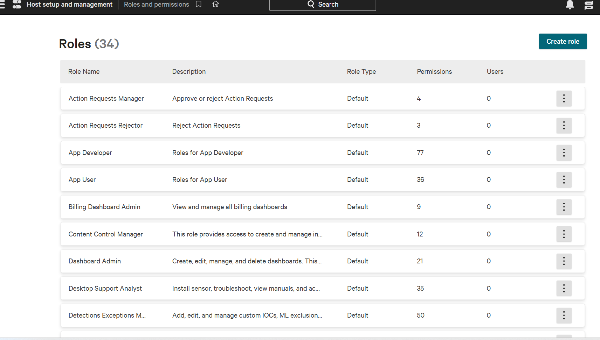
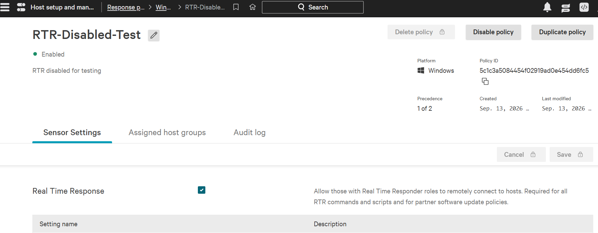

# Practice Exam (CCFA)

- [Practice Exam (CCFA)](#practice-exam-ccfa)
  - [Question 1 of 25 ✅](#question-1-of-25-)
  - [Question 2 of 25❌](#question-2-of-25)
    - [Step-by-step in Falcon Console](#step-by-step-in-falcon-console)
  - [Question 3 of 25 ✅](#question-3-of-25-)
    - [Why](#why)
  - [Question 4 of 25 ✅](#question-4-of-25-)
  - [Question 5 of 25 ✅](#question-5-of-25-)
    - [Why?](#why-1)
  - [Question 6 of 25✅](#question-6-of-25)
    - [Why?](#why-2)
  - [Question 7 of 25✅](#question-7-of-25)
    - [Why?](#why-3)
  - [Question 8 of 25✅](#question-8-of-25)
    - [Why?](#why-4)
  - [Question 9 of 25✅](#question-9-of-25)
    - [Why?](#why-5)
  - [Question 10 of 25✅](#question-10-of-25)
    - [Why?](#why-6)
  - [Question 11 of 25✅](#question-11-of-25)
    - [Why](#why-7)
  - [Question 12 of 25✅](#question-12-of-25)
  - [Question 13 of 25✅](#question-13-of-25)
  - [Question 14 of 25✅](#question-14-of-25)
  - [Question 15 of 25✅](#question-15-of-25)
  - [Question 16 of 25✅](#question-16-of-25)
  - [Question 17 of 25✅](#question-17-of-25)
  - [Question 18 of 25✅](#question-18-of-25)
  - [Question 19 of 25✅](#question-19-of-25)
  - [Question 20 of 25](#question-20-of-25)
  - [Question 21 of 25✅](#question-21-of-25)
  - [Question 22 of 25✅](#question-22-of-25)
  - [Question 23 of 25✅](#question-23-of-25)
    - [why?](#why-8)
  - [Question 24 of 25 ✅](#question-24-of-25-)
  - [Question 25 of 25✅](#question-25-of-25)

✅❌

## Question 1 of 25 ✅

You are the Falcon Administrator for your organization, and you suspect one of your users disabled your custom Windows sensor update policy.

Which of the Audit logs would confirm or deny your suspicion?

- Falcon UI✅
- Prevention policy debug
- Sensor visibility exclusions
- RTR

```
## Exam Flow
- Who changed a configuration in Falcon? → Falcon UI audit log
- Falcon UI audit logs record administrative actions performed through the Falcon console, such as changing or disabling a policy.
```

## Question 2 of 25❌

You have been asked to collect the sensor diagnostics logs for an online Windows host in a remote office to troubleshoot an application compatibility issue.

Which procedure should you use?

- Have the end user run the falcon_sensor --collect-logs command
- Use the Microsoft Remote Desktop tool to collect the Falcon Sensor logs from the %SYSTEMROOT%\Temp folder
- On the Host management page, select the host, then click collect diagnostics
- Use Real Time Response to execute CSWINDIAG and then collect the CSWINDIAG logs from the host✅

```
## Exam flow

- Remote Windows host + collect sensor diagnostic logs → RTR → CSWINDIAG ✅
- The important clues are “online Windows host” and “remote office.”
- RTR (Real Time Response) lets the Falcon administrator remotely connect to an online endpoint and run diagnostic commands without needing the user to do anything.
```

#### Step-by-step in Falcon Console

1. Go to Host setup and management → Host management.
2. Find the target Windows host.
3. Open the host and start a Real Time Response session.
4. In the RTR command window, execute:
   `cswindiag`
5. You should see a response indicating that the process was successfully started. CrowdStrike's own PSFalcon example uses exactly the cswindiag RTR command.
6. Wait for the diagnostic collection to finish.
7. The diagnostic archive is created on the host. CrowdStrike's automation example looks under:
   `C:\Program Files\CrowdStrike\Rtr\PutRun`
   for the newly created CSWinDiag\*.zip file.

8. Use RTR's get capability to retrieve the resulting diagnostic archive to your local system. The PSFalcon example demonstrates this collection flow

## Question 3 of 25 ✅

You need to set up a group to test the newest sensor version.

Which two actions should you take before adding hosts to your test group?

```
1. Assign Auto N-2 sensor update policy
Ensure Auto N-2 is at the highest policy precedence for all OS platforms

2.Assign Auto-Latest sensor update policy✅
Ensure Auto-Latest is at the highest policy precedence for all OS platforms

3. Manually assign the latest version to each sensor update policy
Ensure that policy is at the lowest policy precedence for all OS platforms

4. Assign Auto N-1 sensor update policy
Ensure Auto N-1 is at the lowest policy precedence for all OS platforms
```

#### Why

```
Automatically keep the assigned hosts on the latest available Falcon Sensor version.
Auto-Latest policy
→ automatically selects the newest sensor release
→ hosts assigned to that policy update to that version
→ use the test group to validate the new version
```

## Question 4 of 25 ✅

Where can you find the sensor version for a specific endpoint?

- Host groups
- Sensor downloads
- Host Management✅
- Sensor coverage lookup

## Question 5 of 25 ✅

The Falcon Sensor was installed on a Virtual Machine template using the installation parameter NO_START=1. After installation, the Virtual Machine template is rebooted.

- What is the effect on the Falcon Sensor after reboot?
- The Falcon Sensor will start at reboot and generate a new Agent ID✅
- The Falcon Sensor will start at reboot with the same Agent ID
- The Falcon Sensor will not start until you set an Agent ID

#### Why?

> Prevents the sensor from starting up after installation. The next time the host boots, the sensor will start and be assigned a new agent ID (AID). This parameter is usually used when preparing master images for cloning.

```
             MASTER VM TEMPLATE
                    │
          Install Falcon Sensor
             NO_START=1
                    │
          Sensor stays stopped
                    │
              Reboot template
                    │
          Sensor starts + gets NEW AID
                    │
          ┌─────────┼─────────┐
          ↓         ↓         ↓
        VM-1       VM-2      VM-3
```

- The reason is cloning.
- Each cloned VM needs its own unique Agent ID (AID).

## Question 6 of 25✅

Which action is available for an existing API Client?

- Delete an API Client✅
- Copy an API Client
- Show an API Client Secret
- Retrieve an API Client Secret

#### Why?

What an "API Client" is in Falcon

> In the Falcon console, under Support and resources → API Clients and Keys, an "API Client" is essentially an OAuth2 service-account credential pair: a Client ID and Client Secret. It's the same pattern as an AWS IAM access key/secret pair or a service account key in GCP — a non-human identity that a script, integration, or SIEM connector authenticates with instead of a person logging in. Each API Client also has scopes attached to it (e.g., "Hosts: Read", "Detections: Read/Write"), which limit exactly which Falcon REST endpoints that credential is allowed to call.

Why "Delete an API Client" is the available action

> The exam question is testing a specific quirk of the console UI's lifecycle for these credentials:

> Once you create an API Client, the Client Secret is shown to you exactly once, at creation time. Falcon does not let you edit an existing client's ID or re-display its secret afterward — if you lose the secret, your only path is to revoke/reset it, not "edit" it in place. There's also no rename/relabel action on an existing client in the base console. What the console does let you do to an existing client is delete it outright, which immediately revokes its ability to authenticate.

## Question 7 of 25✅

What controls the rate at which your sensors will receive A Falcon sensor in your environment?

- Channel file update throttling
- Maintenance tokens
- Sensor update policy
- Sensor update throttling✅


#### Why?

- Support and resources → General settings → Security → Throttle updates
- Limit how many sensor updates can be initiated per minute. Consider increasing the limit if updates are taking too long and decreasing if using too much network bandwidth.

## Question 8 of 25✅

You are writing a new Fusion SOAR workflow to remediate new detections of malware.
Which Fusion SOAR workflow trigger will accomplish this?

- New Case Trigger
- Alert - EPP Detection Trigger✅
- Hourly Scheduled Trigger
- Audit - New Detection Trigger

#### Why?

- Next-Gen SIEM → Fusion SOAR → Workflows.
- if this security event happens, automatically do that.
- **Alert - EPP Detection Trigger** fires the moment Falcon's Endpoint Protection (EPP) engine raises a new detection (malware, exploit, etc.) on a host — that's exactly "a new detection of malware," so this is the trigger that gives you a real-time, per-event hook to kick off remediation (isolate host, kill process, notify SOC, etc.).
- **New Case Trigger** fires on Falcon case creation/updates
- **Hourly Scheduled Trigger** is time-based, not event-based
- **Audit - New Detection Trigger** doesn't exist



## Question 9 of 25✅

To enhance your security, you want to detect on a list of IP addresses.
How can you use IOC management to accomplish this?

- Import the list of IP addresses and set the action to Prevent/Block
- Import the list of IP addresses and set the action to Detect Only✅
- Import the list of IP addresses and set the action to No action

### Why?

- IOC: a custom list of known-bad hashes, domains, or IPs you feed Falcon to detect or block.
- Endpoint security → IOC Management



## Question 10 of 25✅

False positive detections are being generated by a single binary application provided by a business vendor running on multiple endpoints.

How should the false positives be managed?

```
1. Using Custom IOA rule groups, add the binary application to the applicable rule group and assign it to a host group that uses the application

2. Using IOC Management, add the SHA-256 hash of the binary application and set the action to Block, hide detection

3. Using Custom IOA rule groups, add the binary application to the applicable rule group and add the rule group to the appropriate prevention policy

4. Using IOC Management, add the SHA-256 hash of the binary application and set the action to Allow✅
```

### Why?

- known-good/known-bad single file → IOC Management + hash + Allow/Block/Detect.
- Endpoint Security → IOC Management → Add hashes
  st approach is to create an IOC exclusion/allow for the known-good binary using its SHA-256 hash.



## Question 11 of 25✅

A member of your SECOPS team currently has the role of Falcon Security Lead and is able to manage detections, quarantine files and reset user credentials.

Which additional default role is also required to allow them to manage sensor deployment and maintain sensor configuration and update policies?

- Endpoint Manager✅ (73)
- Remediation Manager (19)
- Detections Exception Manager (50)
- Desktop Support Analyst (35)

TTSUSTraining@9QAZ

### Why

- `Host management -> Falcon User -> User Management`
- https://falcon.us-2.crowdstrike.com/users-v2/roles-and-permissions
- Endpoint Manager: Manage sensor deployment and maintain sensor configuration and update policies. Create, edit, and delete host groups. Download Forensics app. (73)
- Remediation Manager: View and manage remediation actions taken by Falcon.
- Detections Exception Manager: Add, edit, and manage custom IOCs, ML exclusions, IOA exclusions, and sensor visibility exclusions. (50)
- Desktop Support Analyst: Install sensor, troubleshoot, view manuals, and access documentation about products' functions & restrictions. (35)



## Question 12 of 25✅

What type of exclusion should be used with caution as it may include syntax that could introduce additional security risks such as malware or other attacks which would not be recorded, detected, or prevented?

- Machine Learning Exclusions
- IOC Exclusions
- IOA Exclusions
- Sensor Visibility Exclusion✅

```
Why?

Machine Learning Exclusions — trust a file, skip ML-based detection/blocking on it.
IOA Exclusions — silence one specific behavioral (IOA) detection rule.
IOC Exclusions — not a real Falcon exclusion type (distractor).
Sensor Visibility Exclusions — sensor stops recording that path entirely; nothing detected or blocked there.

- Endpoint security → Configure → Exclusions
- IOA (Indicator of Attack) pattern
- IOC Exclusions - not exist in Falcon

## ML Exclusions
- the Claude desktop app or ChatGPT desktop app.

C:\Users\*\AppData\Local\AnthropicClaude\*.exe
C:\Users\*\AppData\Local\Programs\ChatGPT\*.exe

- That tells Falcon's ML engine "trust anything matching this path going forward," so future auto-updates to that same app don't keep re-triggering detections — while the sensor still keeps recording and applying every other detection layer (behavioral/IOA, IOC, etc.) to that app, since ML Exclusions only turn off the ML/static-file engine, not full visibility (unlike Sensor Visibility Exclusions from the last question).

I don't have evidence that Claude or ChatGPT desktop actually gets flagged by CrowdStrike in practice — this is illustrating the mechanism (new/low-prevalence auto-updating binaries) using apps you already have on your laptop, not a documented incident.

```

## Question 13 of 25✅

What is a valid step when troubleshooting sensor installation failure?

- Confirm all required services are running on the system✅
- Reinstall with VDI=1 and NO_START=1 parameters
- Delete any available application crash log files
- Disable SSL and TLS on the host

```
## Why?
1. Host Setup and Management > Sensor Downloads.
2. Installing via command line
WindowsSensor.exe /install /quiet /norestart CID=YOUR-CUSTOMER-ID
3. sc query csagent in PowerShell/cmd — should show STATE: RUNNING
```

- https://docs.crowdstrike.com/access?ft:originId=qf3c7dcc
- `/install` - Install the sensor (default)
- `/quiet` - Show no UI and no prompts

## Question 14 of 25✅

You are troubleshooting a host that is showing Changes Pending under the Sensor Update policy within Host Management.

What is the first step you should take?

- Generate a CSWinDiag and review the logs
- Uninstall and reinstall the sensor
- Verify the host is online✅
- Verify allowlists for the appropriate FQDN/IP Addresses

```
## Why?

"Changes Pending" means the Falcon Console has queued a policy update (in this case, a sensor version update) for the host, but the sensor hasn't checked in to actually apply it yet. That status just reflects the last known communication state — so the very first thing to rule out is whether the host is even online and able to talk to the CrowdStrike cloud at all.
```

## Question 15 of 25✅

What least privilege role would be utilized to extract a quarantined file as a password protected .zip?

- Falcon Administrator
- Falcon Analyst
- Falcon Security Lead
- Quarantine Manager✅

```
## Why?

- Falcon Administrator — full console control (users, policies, deployment).
- Falcon Security Lead — broad oversight and configuration access, but not full admin.
- Falcon Analyst — investigates detections/alerts; day-to-day triage work.
- Quarantine Manager — manages quarantined files only (view, download, release, delete).
```

## Question 16 of 25✅

An internally used customer application is being blocked by the Falcon sensor. The application is updated infrequently. Which IOC type and action should you set to allow use of the application?

- Add the IPs the application uses and set action to No Action
- Add the name of the application and set action to Allow
- Add the hash of the application and set action to Allow✅
- Add the domain of the application host location and set action to No Action

```
# Why?
The hash-based IOC is the right fit because a hash identifies that exact, specific binary.

C:\Users\hirok>certutil -hashfile "C:\Program Files\Google\Chrome\Application\chrome.exe" SHA256
SHA256 hash of C:\Program Files\Google\Chrome\Application\chrome.exe:
fa570275efc14bd1da9db152d67694f61ca0e36d59a031ab4827f27b3cf0c08d
CertUtil: -hashfile command completed successfully.
```

## Question 17 of 25✅

When deploying the Falcon Sensor alongside an existing security solution, you have aligned to the Phase 2: Interim Protection prevention policy in Falcon.

After initial testing, what is the recommended configuration?

- Disable or remove the other AV solution✅
- Maintain current AV solution posture
- Create an exclusion only for Falcon in the current AV solution
- Create an SVE only in Falcon for the current AV solution

```
## Why?
- Phase 1: Visibility only, no blocking.
- Phase 2: Prevention on, coexists with legacy AV.
- Phase 3: Full protection, legacy AV removed.
- (Console) Endpoint Security > Prevention Policies
```

## Question 18 of 25✅

What action allows you to prevent a trusted file path from being uploaded to the CrowdStrike Cloud without disabling uploads globally?

- A machine-learning exclusion✅
- An IOA exclusion
- A Sensor Visibility exclusion
- A Custom IOC entry

```
## Why?
- It's Falcon's own ML — not anything installed on the host.
- "Machine learning" in that menu refers specifically to CrowdStrike's malware-detection ML engine, which ships as part of the Falcon sensor itself.
-It has nothing to do with any machine-learning software, framework, or model that might separately exist on the endpoint
- When you create a machine-learning exclusion for C:\Program Files\ContosoApp\**, you're telling Falcon's own detection engine: "don't run your ML-based scanning against files matching this path"

## ML exclusion vs. IOA exclusion
- ML exclusions suppress Falcon's file-based ML detection engine
- IOA exclusions suppress Falcon's behavioral detection engine
- Both are Falcon's own internal engines — the label just names which one the exclusion targets.
```

## Question 19 of 25✅

You must create a host group for Windows 11 Workstations that will be easy to maintain. There are no existing Windows 11 hosts in your environment.

What is the correct sequence of steps to accomplish this?

```
A) ✅
1. Add a New Host Group, Type Dynamic
2. EDIT the Assignment Rule, use the filter OS Version
3. Type Windows 11
4. Save Host Group

B)
1. Clone an existing Host group
2. EDIT the Assignment Rule, add OS Version - Windows 11
3. Save the host group

C)
1. Add a New Host Group, Type Static
2. EDIT the Assignment Rule, use the filter Platform, Windows
3. Save Host Group
```

```
### Why?
- Dynamic host group: membership auto-updates based on a rule (e.g., OS version = Windows 11) — no manual adding/removing.

- Host setup and management -> Host groups -> Create new group (Name, Desc, Dynamic)
Edit assignment rule -> OS version = Windows11
```

## Question 20 of 25

An organization is undergoing an internal security review.

Which report can be used to view records related to the creation of API client and secret pairs?

- Falcon UI Audit Log
- Falcon RTR Audit Log
- API Clients and Keys
- API Audit Trail✅ - Check if this is the correct answer

```
### Why?
- The question is asking specifically for a log of creation events — who created an API client/secret pair and when — not a place to manage the clients themselves. That distinction is what separates the four options:
- Support and Resources → Resources and Tools.
```

## Question 21 of 25✅

You want to install the Falcon sensor on a host specifically using Red Hat Enterprise Linux that has installation tokens enabled.

Which command should you use?

```
1. sudo zypper /opt/CrowdStrike/falconctl -s --CID=<CID> --prov-token=ABCD1234
2. sudo /opt/CrowdStrike/falconctl -s --cid=<CID> --provisioning-token=ABCD1234✅
3. sudo /opt/CrowdStrike/falconctl -s -t ABCD1234
4. sudo yum install <installer_filename>
```

```
## Linux

1. Install the downloaded RPM
sudo yum install falcon-sensor-8.10.19402-1.el7.x86_64.rpm

2. Configure CID + provisioning token
sudo /opt/CrowdStrike/falconctl -s --cid=59C8F9C01A5949289CFAD47712E2F274-07 --provisioning-token=E3A75AFD

3. Start the sensor
sudo systemctl start falcon-sensor

### Windows
1. Open PowerShell as Administrator

2. C:\Users\hirok\Downloads\FalconSensor_Windows.exe" /install /quiet /norestart CID=59C8F9C01A5949289CFAD47712E2F274-07 ProvToken=E3A75AFD
```

## Question 22 of 25✅

When creating a custom IOA for a specific domain, which syntax would be best for detecting or preventing on all subdomains as well?

- `**baddomain\.xyz|baddomain\.xyz**`
- `.*.\.baddomain\.xyz`
- `.*baddomain.xyz`
- `.*\.baddomain\.xyz|baddomain\.xyz`✅

`

## Question 23 of 25✅

You have a set of hosts in their own group that should not be accessed via Real Time Response (RTR).
What action will disable RTR on these hosts?

- Edit the Default Response Policy, toggle the RTR switch off, and assign the policy to the host group
- Create a new Response Policy and add the host name to the exceptions list under Real Time Functionality
- Apply a top precedence policy with the RTR access turned off to the host group✅
- Edit the Default RTR Policy to exclude the host group

### why?

- Host setup and management → Response Policies



## Question 24 of 25 ✅

A Falcon sensor in your environment is generating alerts for a binary that has already been allowlisted.
Which report can be used to determine if this is caused by a stale prevention policy?

- Prevention Policy Audit Log✅
- Prevention Policy Debug Audit Log
- Machine-Learning Prevention Monitoring Audit Log
- Sensor Visibility Exclusions Audit Log

```
### Why?

- The key phrase in the question is "stale prevention policy" — not stale exclusion, not stale allowlist entry. That's specifically asking you to check whether the policy itself
- Audit logs -> Prevention Policy -> Prevention policy audit trail
```

## Question 25 of 25✅

What is the most efficient sequence of steps to delete a sensor update policy?

1. From the policy's settings, disable the policy, then click Delete✅
2. From the policy's settings, disable all toggles first, then click Delete
3. Remove the policy from all assigned host groups, disable the policy, then click Delete from the policy's settings
4. Remove the policy from all assigned host groups, then click Delete from the policy's settings

```
### Why?

Host setup and management -> select a policy -> Disable policy
```
